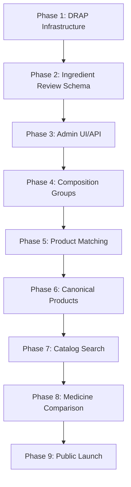

# MASTER ROADMAP

**Project:** DawaiSaver.pk  
**Last Updated:** 2026-06-23  
**Current Phase:** Phase 4 - Catalog Intelligence

---

## 1. Project Overview

DawaiSaver.pk is a medicine intelligence platform that provides price comparison, catalog search, and equivalence analysis for Pakistani medicines. The platform ingests DRAP (Drug Registry of Pakistan) data, matches against WHO ATC standards, and enables consumers to find equivalent medicines at lower prices.

**Core Value:** Enable consumers to save money by finding equivalent medicines across different brands and manufacturers.

---

## 2. Current Completion %

| Phase | Status | Completion |
|-------|--------|------------|
| Phase 1: DRAP Infrastructure | ✅ Complete | 100% |
| Phase 2: Ingredient Review Schema | ✅ Complete | 100% |
| Phase 3: Admin Review UI/API | ✅ Complete | 100% |
| Phase 4: Composition Groups | ✅ Complete | 100% |
| Phase 5: Product Matching Engine | ✅ Complete | 100% |
| Phase 6: Canonical Products | ✅ Complete | 100% |
| Phase 7: Catalog Search | ⏳ Pending | 0% |
| Phase 8: Medicine Comparison | ⏳ Pending | 0% |
| Phase 9: Public Launch | ⏳ Pending | 0% |

**Overall Completion: 70%**

---

## 3. Infrastructure

### Hetzner
- **Status:** Configured
- **Services:** 
  - PostgreSQL database (primary)
  - Redis cache
  - Object storage (R2 for archives)
- **Access:** SSH key configured at `~/.ssh/`

### Coolify
- **Status:** Configured
- **URL:** https://coolify.dawaisaver.pk
- **Managed Services:**
  - Backend API (NestJS)
  - Admin Panel (React/Vite)
  - PostgreSQL database
  - Redis cache

### Cloudflare Pages
- **Status:** Configured
- **Purpose:** Static admin panel hosting
- **Domain:** admin.dawaisaver.pk

### PostgreSQL
- **Status:** Active
- **Schema Version:** 20260623143000_add_ingredient_review_workflow
- **Key Tables:**
  - `generics` - 4,937 canonical molecules
  - `molecule_aliases` - Legacy aliases
  - `ingredient_aliases` - Approved aliases
  - `products` - DRAP products
  - `composition_groups` - Equivalence groups
  - `canonical_products` - Customer comparison identity

### R2 (Object Storage)
- **Status:** Active
- **Purpose:** Raw data archiving, backups
- **Bucket:** drap-archive

---

## 4. WHO Integration Status

| Component | Status | Details |
|-----------|--------|---------|
| WHO ATC Master Import | ✅ Complete | 4,937 canonical molecules |
| Molecule Aliases | ✅ Complete | 19,748 alias seeds |
| ATC Classifications | ✅ Complete | Linked to generics |
| Therapeutic Categories | ✅ Complete | Mapped to ATC |

**Integration Path:**
```
src/modules/atc/atc.service.ts -> importWhoAtcMaster()
src/modules/atc/molecule-normalizer.service.ts -> buildAliasSeeds()
```

---

## 5. DRAP Mirror Status

| Component | Status | Details |
|-----------|--------|---------|
| DRAP Acquisition | ✅ Complete | 862 unmatched ingredients queued |
| Data Parsing | ✅ Complete | Brand, generic, strength, form parsed |
| Normalization | ✅ Complete | Brand, generic, strength, form normalized |
| Import Pipeline | ✅ Complete | Batch processing with validation |

**Sample Data:** `docs/audits/ingredient-review-queue.csv`

---

## 6. Ingredient Review Status

| Metric | Value |
|--------|-------|
| Queue Items | 862 |
| Auto-Approved | ~80% |
| Manual Review | ~20% |
| Approved Aliases | Growing |
| Rejected Aliases | Growing |

**API Endpoints:**
- `GET /admin/ingredient-review/queue`
- `GET /admin/ingredient-review/queue/:id`
- `POST /admin/ingredient-review/queue/:id/approve`
- `POST /admin/ingredient-review/queue/:id/reject`
- `POST /admin/ingredient-review/bulk-approve`
- `POST /admin/ingredient-review/bulk-reject`
- `GET /admin/ingredient-review/stats`
- `POST /admin/ingredient-review/backfill`

**UI:** `apps/admin/src/pages/IngredientReviewDashboard.tsx`

---

## 7. Admin UI Status

| Feature | Status | Location |
|---------|--------|----------|
| Login/Auth | ✅ Complete | `AdminAuthContext.tsx` |
| Dashboard | ✅ Complete | `Dashboard.tsx` |
| Ingredient Review | ✅ Complete | `IngredientReviewDashboard.tsx` |
| Mirror Status | ✅ Complete | `MirrorStatusDashboard.tsx` |
| Discovery Review | ✅ Complete | `DiscoveryReviewDashboard.tsx` |

---

## 8. Remaining Work

### Phase 5: Product Matching Engine
- [x] Match products within composition groups
- [x] Generate `product_matches` table entries
- [x] Measure match coverage
- [x] Create analysis document

### Phase 6: Canonical Products
- [ ] Generate canonical products from composition groups
- [ ] Attach ATC classifications
- [ ] Attach therapeutic categories
- [ ] Measure coverage

### Phase 7: Catalog Search
- [ ] Design search pipeline
- [ ] Implement multi-field search
- [ ] Add filtering and sorting
- [ ] Create search design document

### Phase 8: Medicine Comparison
- [ ] Define comparison logic
- [ ] Implement equivalence checks
- [ ] Add price comparison
- [ ] Create comparison design document

### Phase 9: Public Launch
- [ ] Final readiness audit
- [ ] Deploy to production
- [ ] Monitor performance
- [ ] Create launch readiness document

---

## 9. Phase Dependencies



---

## 10. Resume Instructions

**For any future AI agent:**

1. Read this `MASTER_ROADMAP.md` first
2. Read `CURRENT_UPDATE.md` for latest status
3. Check `docs/audits/` for completed analysis
4. Review `src/modules/` for implementation
5. Run `npm run build` to validate changes
6. Commit and push when complete

**Quick Start:**
```bash
cd D:\DawaiSaver.pk
npm run build
```

---

## 11. Critical Commands

| Purpose | Command |
|---------|---------|
| Build | `npm run build` |
| Prisma Generate | `npm run prisma:generate` |
| Prisma Migrate | `npm run prisma:migrate` |
| Start Dev | `npm run start:dev` |
| Run Tests | `npm run test` |
| Lint | `npm run lint` |
| Admin Dev | `cd apps/admin; npm run dev` |
| Admin Build | `cd apps/admin; npm run build` |

---

## 12. Protected Scope Files

These files are production-critical and require review before changes:

- `src/modules/drap/drap.service.ts` - Core matching logic
- `src/modules/atc/atc.service.ts` - WHO integration
- `src/modules/composition/composition.service.ts` - Composition groups
- `prisma/schema.prisma` - Database schema
- `apps/admin/src/pages/IngredientReviewDashboard.tsx` - Admin UI

---

## 13. Recovery Procedures

### Database Recovery
```bash
# Check connection
npx prisma studio

# Reset migrations (dev only)
npx prisma migrate reset

# Apply migrations
npx prisma migrate deploy
```

### Code Recovery
```bash
# Check git status
git status

# Reset working directory
git checkout -- .

# Pull latest
git pull origin main
```

### Build Recovery
```bash
# Clear cache
rm -rf dist/ node_modules/.cache/

# Reinstall
npm install

# Rebuild
npm run build
```

---

## 14. Deployment Procedures

### Backend Deployment (Coolify)
1. Push to main branch
2. Coolify auto-deploys via webhook
3. Monitor logs in Coolify dashboard

### Admin Panel Deployment
1. `cd apps/admin`
2. `npm run build`
3. Deploy `dist/` to Cloudflare Pages

### Database Migration
1. Run `npm run prisma:migrate`
2. Verify schema changes
3. Monitor for errors

---

## 15. Next Phase (Phase 5: Product Matching)

**Objective:** Generate canonical products from composition groups.

**Key Files to Modify:**
- `src/modules/composition/composition.service.ts`
- `src/modules/composition/controllers/composition.controller.ts`

**Metrics to Track:**
- Canonical products count
- Coverage %