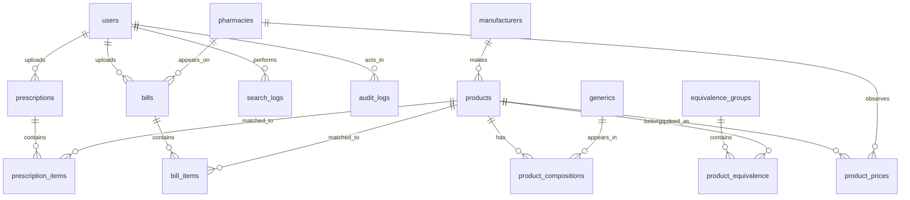

# Database Architecture

## Purpose

The Phase 1 database foundation creates the core relational model for DawaiSaver.pk as a medicine intelligence platform. It supports canonical medicines, generic composition, equivalence groups, price observations, prescriptions, bills, crawl jobs, search logs, and audit logs.

## Implementation Artifacts

- Prisma schema: `prisma/schema.prisma`
- Initial PostgreSQL migration: `prisma/migrations/20260615130000_initial_database_foundation/migration.sql`
- Seed structure: `prisma/seed.ts` and `prisma/seed/README.md`

## Common Table Requirements

Every required table includes:

- UUID primary key
- soft delete field: `deleted_at`
- timestamps: `created_at`, `updated_at`
- `confidence_score`
- `source_type`
- `source_url`
- `status`
- audit fields: `created_by_id`, `updated_by_id`, `deleted_by_id`
- `metadata` JSON for source-specific or future-safe structured data

## Entities

### users

Stores platform users and administrators. User records own prescriptions, bills, search logs, and actor references in audit logs.

### manufacturers

Stores medicine manufacturer identities, aliases, websites, and normalized names.

### generics

Stores normalized active ingredient names and aliases.

### products

Stores medicine products with brand name, normalized brand, dosage form, strength text, pack size, registration number, manufacturer, and canonical signature.

### product_compositions

Joins products to generics with strength values, units, and ingredient order. This is the foundation for composition-based matching.

### equivalence_groups

Groups products by shared composition or other reviewable equivalence rules. Equivalence type is explicit to prevent confusing composition equivalence with clinical substitution.

### product_equivalence

Joins products into equivalence groups with confidence, source attribution, status, and reason code.

### pharmacies

Stores pharmacy identity, city, license number, partner flag, and source attribution.

### product_prices

Stores historical price observations by product, optional pharmacy, city, source, and observation timestamp. These records are append-only in product policy.

### prescriptions

Stores prescription upload references, OCR text placeholders, user association, and review status. OCR implementation is not included in this phase.

### prescription_items

Stores parsed prescription line items, optional matched product, raw text, dosage text, quantity, and confidence.

### bills

Stores pharmacy bill upload references, optional pharmacy, OCR text placeholders, purchase timestamp, and total amount.

### bill_items

Stores parsed bill line items, optional matched product, quantity, unit price, and line total.

### crawl_jobs

Stores ingestion job metadata, adapter name, target URL, timing, result summary, and error information.

### search_logs

Stores user and anonymous search behavior for demand intelligence and unknown product discovery.

### audit_logs

Stores immutable-style audit events for imports, normalization, review, matching, price observations, searches, and mutations.

## Relationships



## Indexing Strategy

### Identity and Normalization

- `manufacturers.normalized_name`
- `generics.normalized_name`
- `products.normalized_brand`
- `products.signature`
- `products.registration_number`
- `pharmacies.normalized_name`

### Workflow and Review Queues

- `status` indexes on reviewable tables
- `crawl_jobs.adapter_name`
- `crawl_jobs.scheduled_at`

### Price Intelligence

- `product_prices(product_id, observed_at)`
- `product_prices.pharmacy_id`
- `product_prices.city`
- `product_prices.source_type`

### User Intelligence

- `prescriptions.user_id`
- `bills.user_id`
- `search_logs.normalized_query`
- `search_logs.city`
- `search_logs.created_at`

### Audit

- `audit_logs.actor_user_id`
- `audit_logs.action`
- `audit_logs(entity_type, entity_id)`
- `audit_logs.correlation_id`
- `audit_logs.created_at`

## Search Strategy

Initial search uses PostgreSQL full-text indexes with the `simple` dictionary:

- products: display name, brand name, strength, registration number
- generics: name and normalized name
- manufacturers: name and normalized name

Future phases may add trigram indexes, phonetic matching, and dedicated search infrastructure if the local PostgreSQL search layer becomes insufficient.

## Normalization Strategy

The database stores both raw source-facing values and normalized values. Normalization must create stable signatures for medicine comparison.

Example signature:

```text
amoxicillin_clavulanic_acid_625mg_tablet
```

Normalization dimensions:

- brand name
- generic ingredient names
- strength and units
- dosage form
- pack size
- manufacturer
- registration number

Ambiguous normalization outputs should stay `PENDING_REVIEW` and keep confidence scores below the auto-verification threshold.

## Historical Policy

Source observations, price observations, crawl outputs, and audit logs should not be overwritten. Canonical records may be corrected, but the source evidence trail must remain available.

