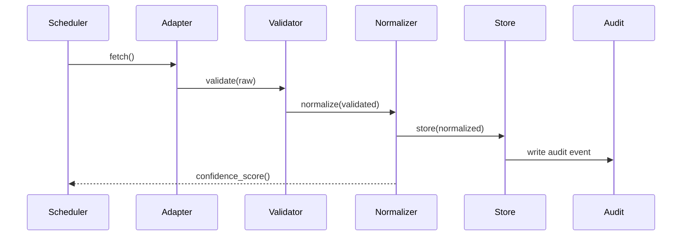
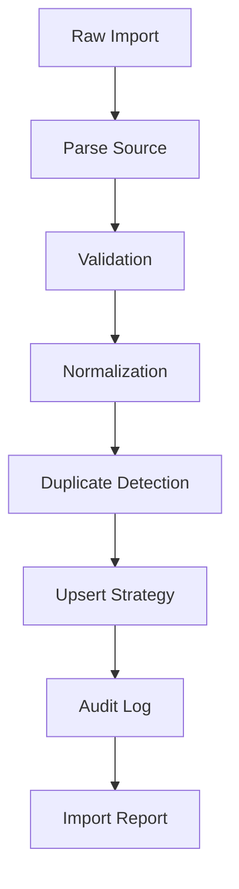
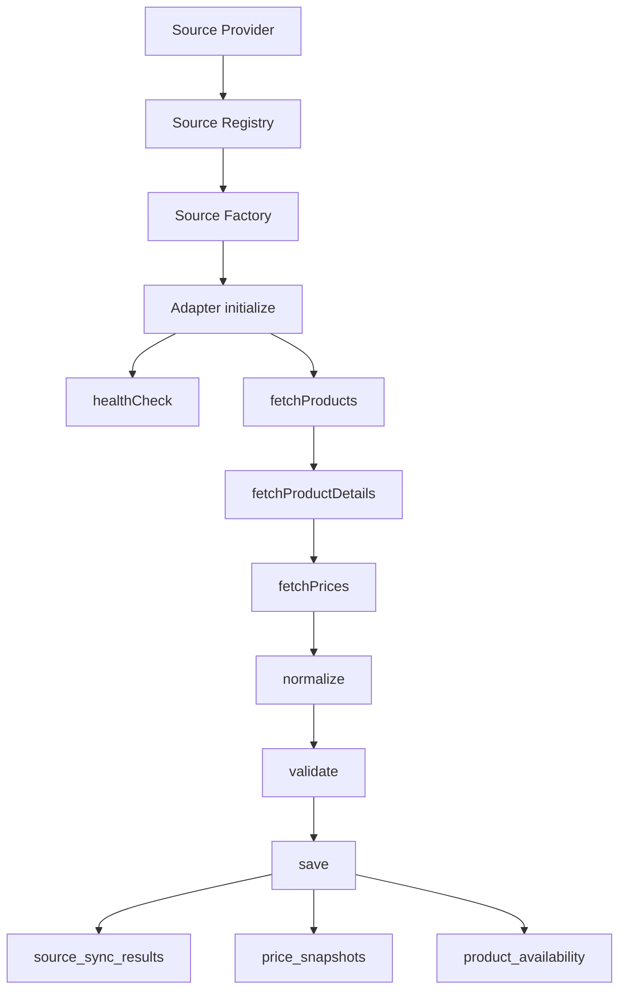

# Data Collection Engine

## Purpose

The data collection engine ingests medicine, price, manufacturer, prescription, bill, and admin-imported data from multiple sources into a source-attributed evidence layer.

## Sources

- DRAP product database
- DRAP registration updates
- Manufacturer websites
- Online pharmacies
- User bills
- User prescriptions
- Admin imports

## Adapter Contract

```ts
interface SourceAdapter<TFetched, TValidated, TNormalized> {
  fetch(): Promise<TFetched>;
  validate(data: TFetched): Promise<TValidated>;
  normalize(data: TValidated): Promise<TNormalized>;
  store(data: TNormalized): Promise<void>;
  confidence_score(data: TNormalized): Promise<number>;
}
```

## Source Metadata

Every stored observation must include:

- source type
- source URL or upload reference
- collection timestamp
- adapter version
- confidence score
- raw payload pointer
- normalized payload pointer
- audit log reference

## Data Integrity Rules

- Never overwrite historical source records.
- Store raw and normalized data separately.
- Log validation failures.
- Retry transient failures with bounded backoff.
- Send low-confidence records to admin review.

## Sequence



## DRAP Import Architecture

The DRAP import foundation lives in `src/modules/drap/`.

Files:

- `drap.module.ts`: module entrypoint and factory helpers
- `drap.service.ts`: application service wrapper
- `drap.importer.ts`: import orchestration
- `drap.normalizer.ts`: normalization and signature generation
- `drap.types.ts`: source adapter, DTO, and Prisma client interfaces

The importer is dependency-light and accepts a Prisma-client-shaped object. This keeps it usable before the NestJS runtime exists and allows it to be wrapped by a Nest provider later.

## Supported DRAP Source Adapters

- CSV: built-in parser
- HTML table: built-in parser
- Excel: supported through an injected parser until an Excel dependency is installed
- Future API: JSON array payload support

Adapter flow:

```text
fetch()
parse()
normalize()
validate()
save()
```

## DRAP Import Workflow



Database support:

- `import_batches`: one row per import attempt
- `import_batch_items`: one row per source row
- `import_errors`: row-level import errors

Canonical writes:

- manufacturers
- generics
- products
- product_compositions
- audit_logs

## DRAP Normalization

Implemented normalization functions:

- `normalizeBrandName()`
- `normalizeGenericName()`
- `normalizeStrength()`
- `normalizeDosageForm()`
- `normalizeManufacturer()`

Medicine signatures are generated from normalized generic, strength, and dosage form.

Example:

```text
amoxicillin_clavulanic_acid_625mg_tablet
```

## Recovery Procedure

1. Read `AI_IMPLEMENTATION_INDEX.md`, `PROJECT_STATE.md`, `PROJECT_MEMORY.md`, and this document.
2. Inspect the latest `import_batches` row for failed or partial imports.
3. Review row-level failures in `import_errors`.
4. Use `import_batch_items.raw_data` and `normalized_data` to replay failed rows.
5. Re-run the import with the same source URL and adapter metadata.
6. Confirm `audit_logs` includes an `IMPORT` event for the completed batch.

Imports are designed to preserve raw row data, normalized row data, source URL, source type, confidence score, and errors so a failed import can be diagnosed without losing evidence.

## Online Pharmacy Framework

The online pharmacy framework lives in `src/modules/sources/` and supports future integrations for Dawaai, Sehat, DVAGO, Servaid, other online pharmacy websites, and APIs.

No provider-specific scraper logic is implemented yet.

## Adapter Architecture

Required adapter methods:

```text
initialize()
fetchProducts()
fetchProductDetails()
fetchPrices()
normalize()
validate()
save()
healthCheck()
```

Core files:

- `source.module.ts`
- `source.types.ts`
- `source.interfaces.ts`
- `source.registry.ts`
- `source.factory.ts`

Worker files:

- `src/workers/source-sync.worker.ts`
- `src/workers/price-sync.worker.ts`

## Source Registration

Source adapters are registered by provider code through `SourceRegistry`.

Examples of future provider codes:

- `dawaai`
- `sehat`
- `dvago`
- `servaid`
- `online_pharmacy`
- `api`

The registry prevents duplicate registrations and the factory initializes adapters with provider context.

## Sync Workflow



## Recovery Workflow

1. Inspect `source_sync_jobs` for failed or partial jobs.
2. Review `source_sync_results` for product, price, and error counts.
3. Check `source_health_logs` for provider outages.
4. Re-run the provider sync with the same provider config.
5. Keep all historical `price_snapshots`; do not overwrite old price observations.
6. Use `price_change_events` to derive later price intelligence.

## Framework Documentation

See `docs/ONLINE_PHARMACY_FRAMEWORK.md` for the full framework plan.
