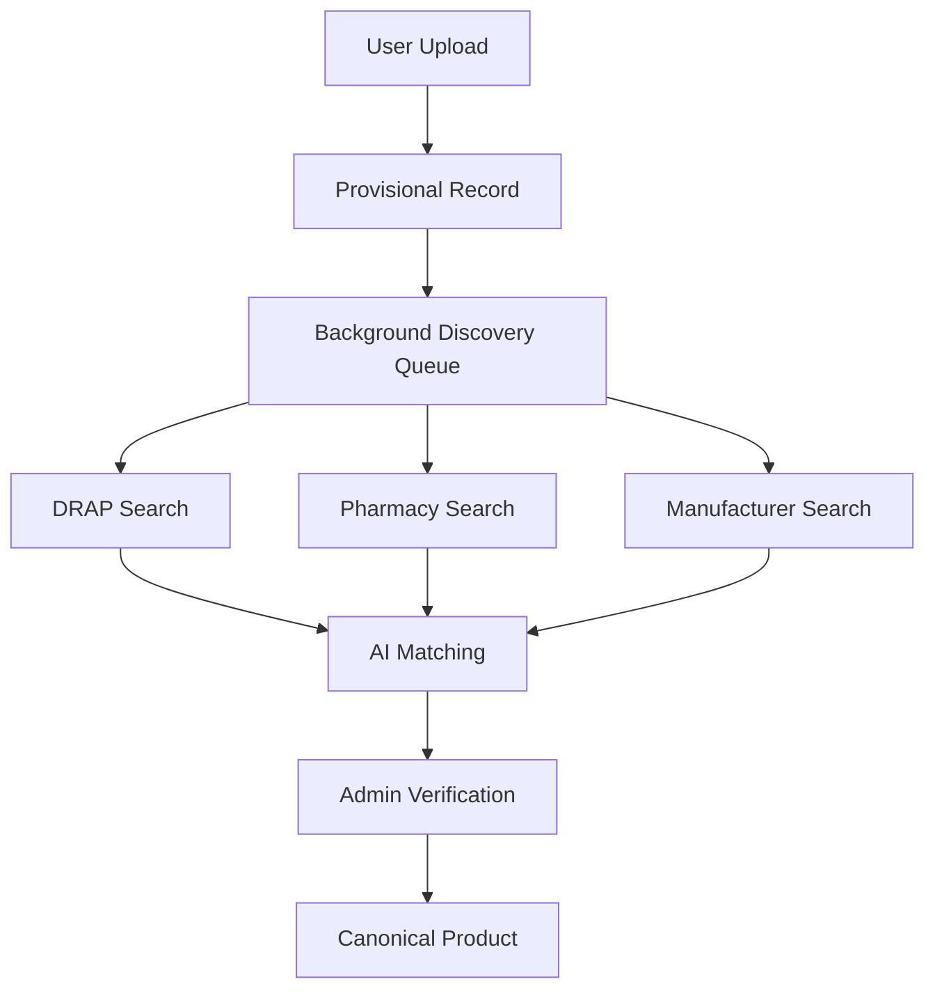

# Data Intelligence Engine

## Purpose

The intelligence engine turns normalized medicine, price, prescription, bill, and search data into reviewable insights.

## Engines

- Alternative recommendation engine
- Price intelligence engine
- Demand intelligence engine
- City-wise intelligence engine
- Prescription cost optimizer
- New product discovery engine

## Intelligence Principles

- Recommendations must include reasons and confidence.
- Intelligence outputs should be reproducible from stored evidence.
- Low-confidence outputs must enter review queues.
- The system should separate composition equivalence from therapeutic substitution.
- User-facing outputs must avoid medical diagnosis or unsafe advice.

## Unknown Medicine Workflow

## Outputs

- Equivalent product candidates
- Cheaper alternatives
- Price spread by pharmacy and city
- Prescription savings report
- Bill overpayment analysis
- Newly discovered medicine candidates
- Demand heatmaps

## Product Discovery Engine

The Product Discovery Engine creates provisional product candidates from under-evidenced or unknown medicines.

Module:

- `src/modules/discovery/`

Sources:

- DRAP imports
- pharmacy snapshots
- search queries
- unknown products
- future bill imports
- future prescription imports

Database outputs:

- `discovery_candidates`
- `discovery_evidence`
- `discovery_reviews`
- `discovery_jobs`
- `discovery_rules`

Discovery confidence combines source confidence, matching confidence, and evidence confidence.

See `docs/PRODUCT_DISCOVERY_ENGINE.md` for discovery workflow, evidence workflow, review workflow, and recovery procedures.

## Price Intelligence Engine

The Price Intelligence Engine transforms raw `price_snapshots` from the source adapter framework into market intelligence.

Module:

- `src/modules/price-intelligence/`

Primary services:

- `PriceIntelligenceService`
- `PriceComparisonService`
- `PriceAnalyticsService`
- `PriceChangeDetectorService`
- `CityPriceAnalyticsService`

Database outputs:

- `product_price_statistics`
- `city_price_statistics`
- `market_price_signals`
- `price_anomalies`
- `price_trends`
- `price_change_events`

Internal service API:

- `getProductStatistics()`
- `getCityStatistics()`
- `getMarketSignals()`
- `detectPriceChanges()`
- `detectAnomalies()`

See `docs/PRICE_INTELLIGENCE_ENGINE.md` for architecture, workflows, recovery procedures, and calculation rules.
