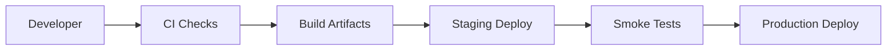

# Deployment Architecture

## Environments

- local development
- staging
- production

## Components

- web PWA
- API service
- worker service
- PostgreSQL
- Redis
- Cloudflare R2 (Primary Storage)
- observability and logs

## Storage Architecture

**Cloudflare R2 is the single source of truth for all persistent storage.**

| Storage Type | Purpose | Persistence |
|--------------|---------|-------------|
| Cloudflare R2 | All uploaded files, OCR artifacts, images | Permanent |
| PostgreSQL | Metadata, records, relationships | Permanent |
| Railway filesystem | Temporary build artifacts | Ephemeral |
| Docker filesystem | Temporary build artifacts | Ephemeral |
| Worker local storage | Temporary processing files | Ephemeral |

All file uploads must be routed through the UploadService to Cloudflare R2. PostgreSQL stores only metadata references (URLs, paths, checksums).

## Backend Runtime

The executable backend runtime is a NestJS application.

Runtime files:

- `package.json`
- `Dockerfile`
- `docker-compose.yml`
- `railway.json`
- `.env.example`

Health endpoints:

- `GET /health`
- `GET /health/database`
- `GET /health/application`

## Deployment Flow

## Release Requirements

- migrations reviewed before deployment
- secrets managed outside source control
- health checks for API and workers
- rollback plan for each production release
- audit log continuity preserved
- queue workers drained or made migration-safe before schema changes

## Railway Environment

Required variables:

- `DATABASE_URL`
- `NODE_ENV`
- `APP_PORT`
- `APP_HOST`
- `CORS_ORIGINS`

Railway healthcheck path is `/health`.
