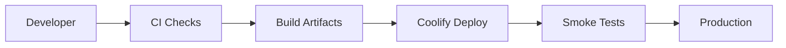

# Deployment Architecture

## Environments

- local development
- production

## Components

- web PWA
- API service
- worker service
- PostgreSQL 18
- Cloudflare R2
- Cloudflare DNS
- observability and logs

## Storage Architecture

**Cloudflare R2 is the single source of truth for all persistent file storage.**

| Storage Type | Purpose | Persistence |
|--------------|---------|-------------|
| Cloudflare R2 | Uploaded files, OCR artifacts, images, generated exports | Permanent |
| PostgreSQL 18 | Metadata, records, relationships | Permanent |
| Local disk | Temporary build artifacts and cache | Ephemeral |

All file uploads must be routed through the UploadService to Cloudflare R2. PostgreSQL stores only metadata references such as URLs, paths, and checksums.

### Required Environment Variables

```env
R2_ACCOUNT_ID=
R2_ACCESS_KEY_ID=
R2_SECRET_ACCESS_KEY=
R2_BUCKET_NAME=dawaisaver-pk
R2_PUBLIC_BASE_URL=
JWT_SECRET=
JWT_REFRESH_SECRET=
DATABASE_URL=
```

## Backend Runtime

The executable backend runtime is a NestJS application.

Runtime files:

- `package.json`
- `Dockerfile`
- `docker-compose.yml`
- `.env.example`

Health endpoints:

- `GET /health`
- `GET /health/database`
- `GET /health/application`

## Deployment Flow



## Release Requirements

- migrations reviewed before deployment
- secrets managed outside source control
- health checks for API and workers
- rollback plan for each production release
- audit log continuity preserved
- queue workers drained or made migration-safe before schema changes

## Production Environment

Required variables:

- `DATABASE_URL`
- `NODE_ENV=production`
- `APP_PORT`
- `APP_HOST=0.0.0.0`
- `CORS_ORIGINS`
- `R2_ACCOUNT_ID`
- `R2_ACCESS_KEY_ID`
- `R2_SECRET_ACCESS_KEY`
- `R2_BUCKET_NAME`
- `R2_PUBLIC_BASE_URL`

Primary deployment platform:

- Hetzner VPS
- Coolify
- PostgreSQL 18
- Cloudflare R2
- Cloudflare DNS
