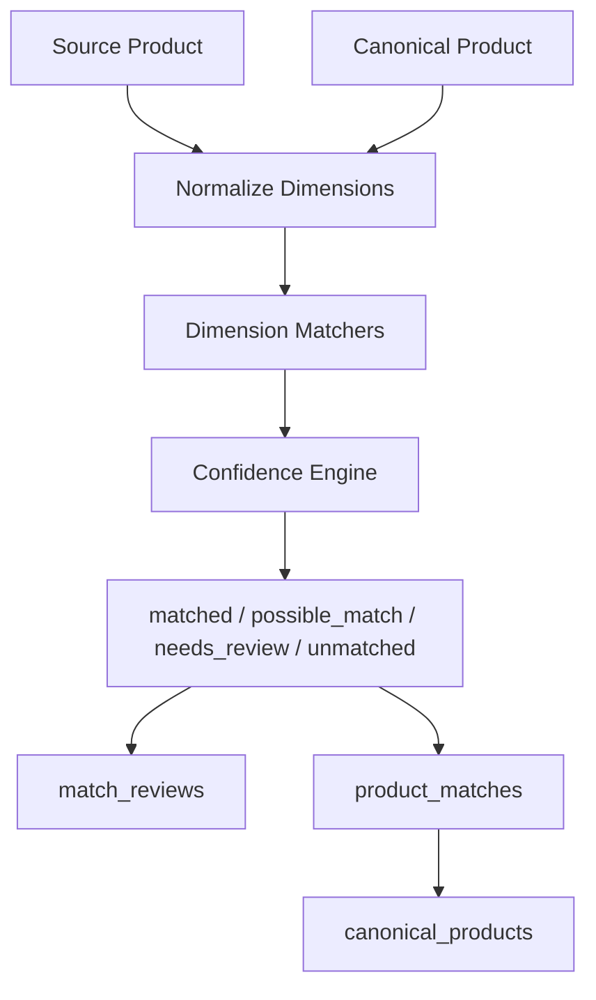

# Medicine Matching Engine

## Purpose

The Medicine Matching Engine creates the canonical medicine identity system for DawaiSaver.pk. It is the single source of truth for medicine matching across DRAP imports, online pharmacy source data, price snapshots, and future user-derived records.

## Scope

Included:

- canonical product identity
- aliases
- product match records
- admin review records
- matching rules
- canonical medicine signatures
- confidence scoring
- duplicate detection

Excluded:

- frontend
- OCR
- prescription uploads
- marketplace
- warehouse fulfillment

## Architecture



## Matching Dimensions

- brand name
- generic name
- strength
- dosage form
- manufacturer
- pack size
- registration number
- medicine signature

## Medicine Signature

The signature is generated from normalized generic, strength, and dosage form.

Examples:

```text
amoxicillin_clavulanic_acid_625mg_tablet
esomeprazole_40mg_capsule
atorvastatin_20mg_tablet
```

## Confidence Rules

Default weights:

- brand: 0.14
- generic: 0.20
- strength: 0.16
- dosage form: 0.10
- manufacturer: 0.10
- pack size: 0.05
- registration number: 0.10
- signature: 0.15

Classification:

- `matched`: final confidence >= 0.92
- `possible_match`: final confidence >= 0.78
- `needs_review`: final confidence >= 0.55
- `unmatched`: final confidence < 0.55

## Review Workflow

1. Create product match candidate.
2. Store confidence breakdown and match explanation.
3. Promote high-confidence matches automatically only after policy allows it.
4. Send lower-confidence matches to `match_reviews`.
5. Admin approves, rejects, merges, or splits the match.
6. Preserve explanation and review notes.

## Duplicate Detection

Detects:

- duplicate brands
- duplicate products
- duplicate manufacturers
- duplicate signatures

## Database Tables

- `canonical_products`
- `canonical_product_aliases`
- `product_matches`
- `match_reviews`
- `matching_rules`

## Recovery Procedures

1. Read `AI_IMPLEMENTATION_INDEX.md`, `PROJECT_STATE.md`, `PROJECT_MEMORY.md`, and this document.
2. Inspect `canonical_products` and `canonical_product_aliases`.
3. Review pending `match_reviews`.
4. Re-run matching from source records using the same matching rules.
5. Compare confidence breakdowns before promoting matches.
6. Preserve rejected and reviewed matches for audit history.

## Next Task

Search API Foundation.

