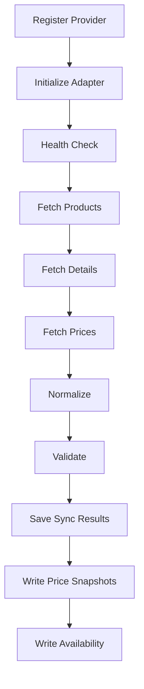

# Online Pharmacy Source Adapter Framework

## Purpose

The online pharmacy source adapter framework defines reusable contracts for Dawaai, Sehat, DVAGO, Servaid, other online pharmacy websites, and future pharmacy APIs.

This phase intentionally does not implement pharmacy-specific scraper logic.

## Supported Source Categories

- Dawaai
- Sehat
- DVAGO
- Servaid
- online pharmacy websites
- future APIs

## Adapter Contract

```ts
interface PharmacySourceAdapter {
  initialize(context): Promise<void>;
  fetchProducts(): Promise<SourceRawProduct[]>;
  fetchProductDetails(product): Promise<SourceProductDetail>;
  fetchPrices(product): Promise<SourceRawPrice[]>;
  normalize(input): Promise<NormalizedOutput>;
  validate(input): Promise<SourceValidationResult>;
  save(input): Promise<SyncResultDto>;
  healthCheck(): Promise<SourceHealthDto>;
}
```

## Module Layout

- `src/modules/sources/source.module.ts`
- `src/modules/sources/source.types.ts`
- `src/modules/sources/source.interfaces.ts`
- `src/modules/sources/source.registry.ts`
- `src/modules/sources/source.factory.ts`
- `src/workers/source-sync.worker.ts`
- `src/workers/price-sync.worker.ts`

## Source Registration

Adapters register by provider code:

```ts
registry.register("dawaai", DawaaiAdapter);
registry.register("sehat", SehatAdapter);
registry.register("dvago", DvagoAdapter);
registry.register("servaid", ServaidAdapter);
```

The current implementation includes only `MockSourceAdapter` for validation. Real providers should be added later behind the same interface.

## Sync Workflow



## Database Tables

Source framework:

- `source_providers`
- `source_provider_configs`
- `source_sync_jobs`
- `source_sync_results`
- `source_health_logs`

Price intelligence foundation:

- `price_snapshots`
- `price_change_events`
- `product_availability`

## Matching Utilities

Common matching functions live in `source.factory.ts`:

- `matchBrand()`
- `matchGeneric()`
- `matchStrength()`
- `matchDosageForm()`
- `generateMedicineSignature()`

## Recovery Workflow

1. Check the failed row in `source_sync_jobs`.
2. Review related `source_sync_results`.
3. Inspect `source_health_logs` for provider outage or blocking signals.
4. Compare latest `price_snapshots` and `product_availability`.
5. Re-run the sync job with the same provider config.
6. Preserve previous snapshots; never overwrite historical price observations.

## Next Task

Price Intelligence Engine.

