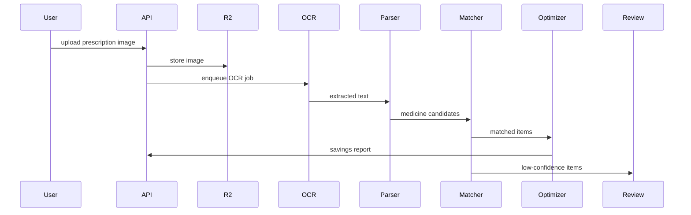

# Prescription Processing Engine

## Purpose

The prescription processing engine converts user-uploaded prescriptions into parsed medicine items, matched products, cost estimates, and savings reports.

## Flow

## Required Outputs

- original upload reference
- OCR text
- parsed prescription items
- candidate product matches
- confidence scores
- unknown items
- cost optimization report
- review status

## Safety Rules

- Do not provide diagnosis.
- Do not instruct users to change prescribed medicine without pharmacist or clinician confirmation.
- Clearly label alternatives as comparison candidates.
- Preserve source image and parsing audit trail.

