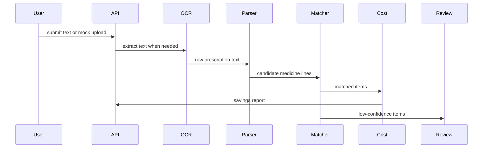

# Prescription Processing Engine

## Purpose

The prescription processing engine converts user-supplied prescription text or mock upload references into parsed medicine lines, canonical medicine matches, cost estimates, and reviewable records.

## Architecture

Modules:

- `src/modules/prescriptions/`
- `src/modules/ocr/`

## Flow

1. Create the prescription record.
2. Parse the input text into raw lines.
3. Match lines against canonical products.
4. Store `prescription_items` rows for the parsed medicines.
5. Estimate original, cheapest, balanced, and premium cost options.
6. Mark low-confidence matches for review.
7. Return a structured result with confidence and safety flags.

## Safety Rules

- Do not provide diagnosis.
- Do not say "replace medicine."
- Use the wording: "Equivalent options with same active ingredient, strength, and dosage form."
- Flag high-risk medicines for manual review.
- Preserve source image or text references and parsing audit trail.

## Recovery Procedure

- Re-read the persisted `prescriptions` row.
- Rehydrate stored `prescription_items`.
- Rebuild the price context from product price observations.
- Re-run the cost estimator and review workflow.
- Keep audit and provenance metadata intact.

