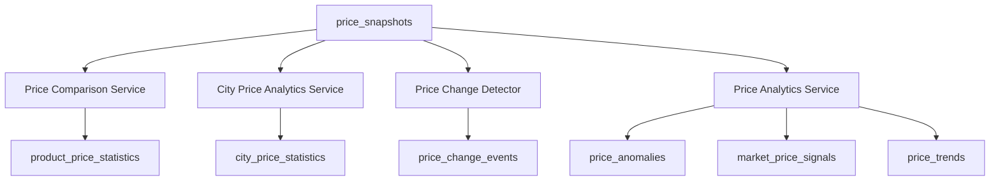

# Price Intelligence Engine

## Purpose

The Price Intelligence Engine transforms raw `price_snapshots` into market intelligence for products, cities, price changes, anomalies, trends, and recommendation signals.

## Scope

Included:

- product-level price statistics
- city-level price statistics
- price change detection
- anomaly detection
- market price signals
- trend calculation

Excluded:

- frontend
- OCR
- prescription uploads
- marketplace
- warehouse fulfillment

## Architecture

## Module Layout

- `src/modules/price-intelligence/price-intelligence.module.ts`
- `src/modules/price-intelligence/price-intelligence.service.ts`
- `src/modules/price-intelligence/price-comparison.service.ts`
- `src/modules/price-intelligence/price-analytics.service.ts`
- `src/modules/price-intelligence/price-change-detector.service.ts`
- `src/modules/price-intelligence/city-price-analytics.service.ts`
- `src/modules/price-intelligence/price-intelligence.types.ts`

## Workflows

### Product Statistics

1. Load valid price snapshots for a product or medicine signature.
2. Remove invalid prices.
3. Calculate lowest, highest, average, median, latest, variance, availability score, source count, sample count, and confidence score.
4. Store results in `product_price_statistics` when persistence is wired.

### City Statistics

1. Group snapshots by city.
2. Remove invalid prices.
3. Calculate lowest observed price, highest observed price, average price, availability percentage, source count, sample count, and confidence score.
4. Store results in `city_price_statistics` when persistence is wired.

### Price Change Detection

1. Group snapshots by product/signature, city, and source.
2. Sort snapshots by capture time.
3. Compare each snapshot against the previous snapshot.
4. Detect price increase, price decrease, new low, new high, and significant change.
5. Persist generated events into `price_change_events` when persistence is wired.

### Anomaly Detection

Detects:

- extreme pricing
- suspicious price drops
- suspicious price spikes
- duplicate prices
- invalid prices

### Market Signals

Generates:

- `best_price`
- `recommended_price`
- `market_average`
- `confidence_score`
- `price_stability_score`

## Calculation Rules

### Average

Sum all valid prices and divide by sample count.

### Median

Sort valid prices. Use the middle value for odd sample counts and the average of the two middle values for even sample counts.

### Price Variance

Calculate population variance over valid prices.

### Availability Score

Available snapshots are `IN_STOCK` and `LIMITED`. Availability score is available snapshots divided by valid snapshots.

### Recommended Price

Use median price because it is less sensitive to extreme values than average price.

### Price Stability Score

Calculate `1 - standard_deviation / average_price`, floored at zero.

### Significant Change

Default threshold is 15 percent absolute change from the previous observed price.

## Recovery Procedures

1. Read `AI_IMPLEMENTATION_INDEX.md`, `PROJECT_STATE.md`, `PROJECT_MEMORY.md`, and this document.
2. Verify source snapshots exist in `price_snapshots`.
3. Re-run statistics calculation from historical snapshots.
4. Re-run change detection by product/signature, city, and source.
5. Review generated `price_anomalies` before using affected prices in user-facing outputs.
6. Preserve all original snapshots; never overwrite historical observations.

## Next Task

Medicine Matching Engine.

