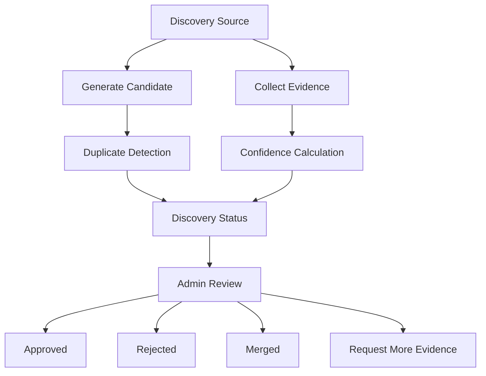

# Product Discovery Engine

## Purpose

The Product Discovery Engine creates a self-learning medicine discovery system. It identifies unknown or under-evidenced medicines from DRAP imports, pharmacy snapshots, search queries, unknown product records, and future bill or prescription imports.

## Scope

Included:

- provisional discovery candidates
- evidence collection
- discovery jobs
- discovery rules
- admin review workflow
- confidence calculation
- duplicate detection

Excluded:

- frontend
- OCR
- prescription uploads
- marketplace
- warehouse fulfillment

## Discovery Workflow



## Evidence Workflow

Evidence stores:

- source
- source type
- source URL
- confidence
- capture date
- supporting fields

Source types:

- DRAP imports
- pharmacy snapshots
- search queries
- unknown products
- future bill imports
- future prescription imports

## Review Workflow

Review decisions:

- approve
- reject
- merge
- request more evidence

Discovery statuses:

- new
- collecting evidence
- needs review
- approved
- rejected
- merged

## Confidence Rules

Overall confidence combines:

- source confidence
- matching confidence
- evidence confidence

Initial formula:

```text
overall = source_confidence * 0.35 + matching_confidence * 0.25 + evidence_confidence * 0.40
```

## Duplicate Detection

Detects:

- existing product matches
- existing canonical products
- existing aliases
- existing signatures

## Database Tables

- `discovery_candidates`
- `discovery_evidence`
- `discovery_reviews`
- `discovery_jobs`
- `discovery_rules`

## Recovery Procedures

1. Read `AI_IMPLEMENTATION_INDEX.md`, `PROJECT_STATE.md`, `PROJECT_MEMORY.md`, and this document.
2. Inspect `discovery_jobs` for failed or stalled discovery runs.
3. Review `discovery_candidates` with status `collecting_evidence` or `needs_review`.
4. Inspect linked `discovery_evidence`.
5. Re-run duplicate detection against canonical products and aliases.
6. Preserve rejected and merged candidates for audit history.

## Next Task

Backend Runtime Foundation.

