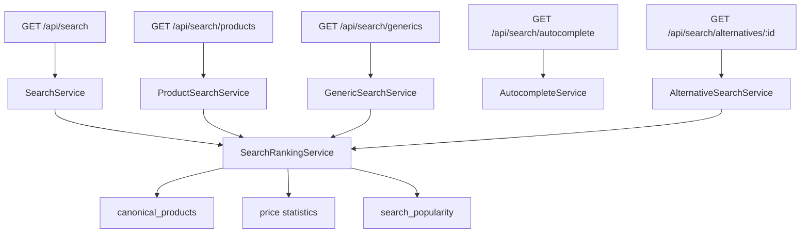

# Search API Foundation

## Purpose

The Search API Foundation creates the public backend search layer over canonical medicine data. It uses canonical identity, matching confidence, price intelligence, availability, and popularity signals.

## Scope

Included:

- brand search
- generic search
- manufacturer search
- medicine signature search
- registration number search
- autocomplete
- ranking
- alternative search
- popularity tracking schema

Excluded:

- frontend
- OCR
- prescription uploads
- marketplace
- warehouse fulfillment

## Architecture



## API Endpoints

```text
GET /api/search
GET /api/search/products
GET /api/search/generics
GET /api/search/autocomplete
GET /api/search/alternatives/:id
GET /api/search/trending
```

## Ranking Factors

- exact brand match
- exact generic match
- medicine signature match
- registration number match
- text similarity
- popularity score
- confidence score
- availability score
- price intelligence score

## Autocomplete

Supports:

- prefix matching
- partial matching
- synonym matching
- typo tolerance
- popular search boosting

## Alternative Search

Returns:

- canonical product
- equivalent brands
- price statistics
- availability
- confidence score

## Database Tables

- `search_cache`
- `search_popularity`
- `search_suggestions`
- `search_synonyms`

## Recovery Procedures

1. Read `AI_IMPLEMENTATION_INDEX.md`, `PROJECT_STATE.md`, `PROJECT_MEMORY.md`, and this document.
2. Verify canonical data exists in `canonical_products`.
3. Rebuild `search_suggestions` from canonical brands, generics, manufacturers, signatures, and registration numbers.
4. Clear expired `search_cache` rows.
5. Recalculate `search_popularity.trending_score` from search logs or popularity records.
6. Keep search responses read-only and preserve source attribution.

## Next Task

Product Discovery Engine.

