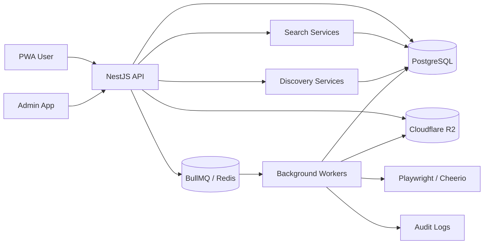

# System Architecture

## System Shape

DawaiSaver.pk is organized around bounded domains:

- Identity and access
- Medicine catalog
- Source ingestion
- Normalization
- Equivalence mapping
- Price intelligence
- Prescription processing
- Bill intelligence
- Recommendation intelligence
- Search and discovery
- Product discovery
- Pharmacy marketplace
- Admin review
- Audit and observability

## Proposed Services

### API Application

NestJS application exposing REST APIs for users, admins, ingestion control, review queues, search, discovery, and intelligence results.

Runtime foundation files:

- `src/main.ts`
- `src/app.module.ts`
- `src/config/`
- `src/database/`
- `src/common/`
- `src/modules/health/`
- `src/modules/*/controllers/`

API controller layer traits:

- REST surface under `/api`
- Swagger/OpenAPI at `/api/docs`
- Standard response envelope
- Standard error envelope
- Placeholder admin and internal guards

### Worker Application

BullMQ workers process OCR, source ingestion, normalization, matching, crawl jobs, and background discovery.

### Search Layer

The search layer exposes backend search services over canonical products, generic names, manufacturer names, medicine signatures, registration numbers, alternatives, popularity, price intelligence, and availability.

### Discovery Layer

The discovery layer creates provisional product candidates from unknown products, source snapshots, DRAP imports, and search queries. It preserves evidence and sends candidates through review before promotion.

### Database

PostgreSQL stores canonical entities, source evidence, historical prices, prescriptions, bills, jobs, and audits.

### Object Storage

Cloudflare R2 stores prescription images, bill images, imported datasets, OCR artifacts, and crawler snapshots.

### Queue

Redis and BullMQ coordinate asynchronous jobs and retries.

## High-Level Flow

## Domain Rules

- All external data is source-attributed.
- Historical records are append-only where practical.
- Recommendations include confidence, reason codes, and evidence links.
- Search results use canonical medicine identity and expose confidence/review status metadata.
- Product discovery candidates must preserve evidence and remain reviewable before promotion.
- Runtime health endpoints must remain available at `/health`, `/health/database`, and `/health/application`.
- API endpoints are exposed under `/api`.
- API documentation is exposed under `/api/docs`.
- Admin review can promote provisional records to verified records.
- Medical advice is not provided; the platform surfaces intelligence and comparison data.
