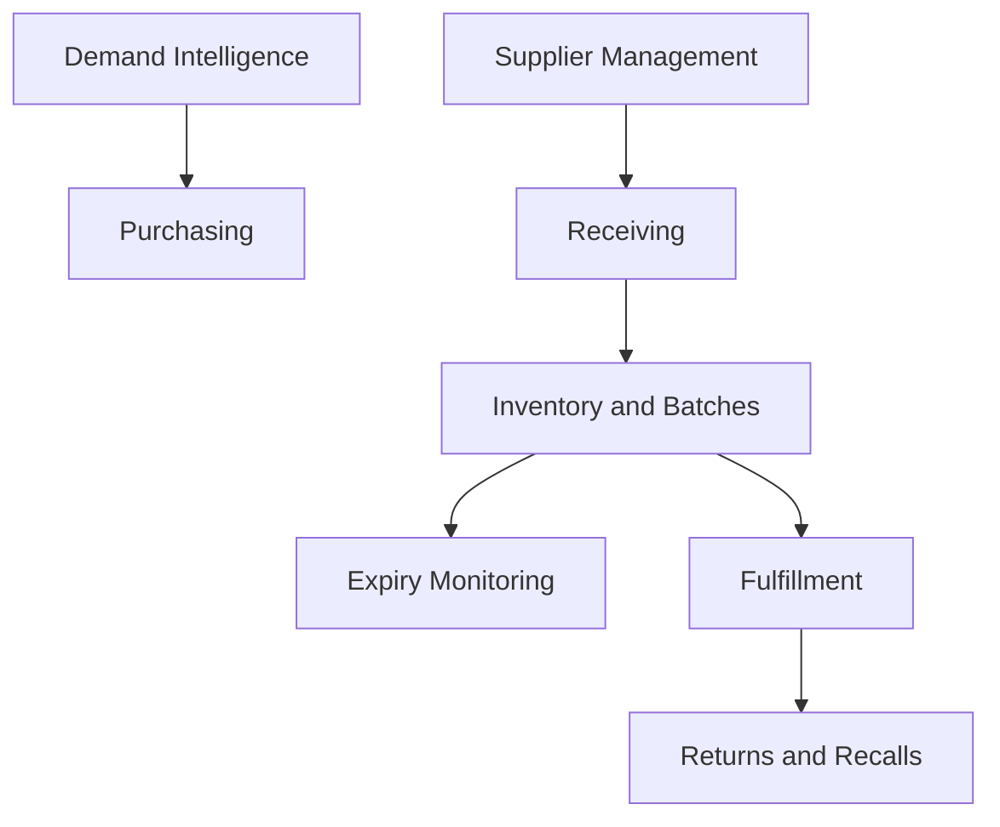

# Warehouse Expansion Plan

## Status

Warehouse fulfillment is future-only. No implementation is planned before intelligence and marketplace validation.

## Future Domains

- inventory
- expiry management
- batch tracking
- supplier management
- purchasing
- receiving
- picking and packing
- fulfillment
- returns
- recalls

## Decision Criteria

Warehouse expansion should be considered only after there is reliable evidence for:

- recurring demand by city
- high savings opportunities
- partner pharmacy limitations
- stable supplier relationships
- regulatory readiness
- operational capital availability

## Future Architecture

