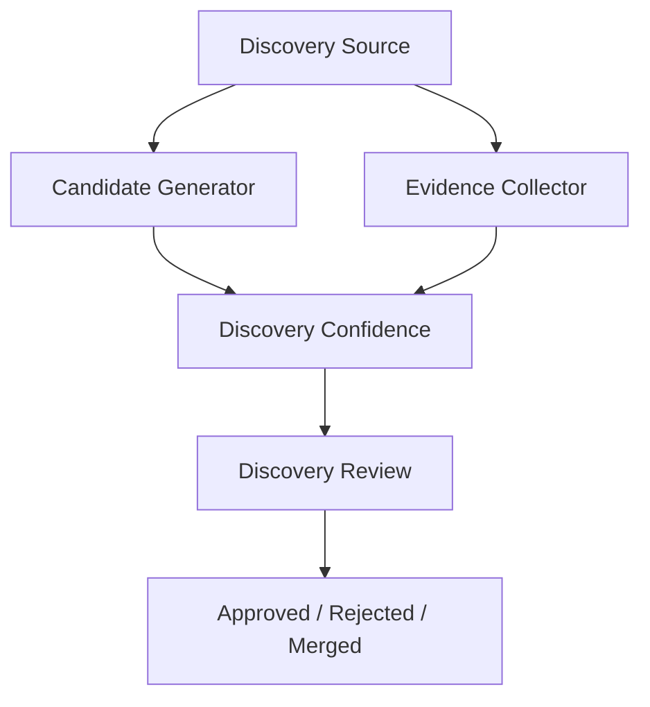
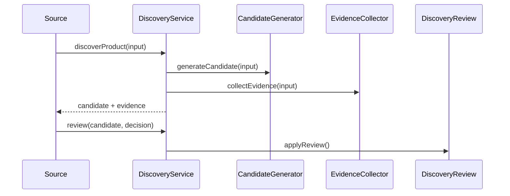

# Product Discovery Engine

## Purpose

The Product Discovery Engine creates a self-learning discovery system for medicines that appear in DRAP imports, pharmacy snapshots, search queries, unknown product flows, and future bill or prescription imports.

## Files

- `discovery.module.ts`: module factory and exports
- `discovery.service.ts`: internal service facade
- `product-discovery.service.ts`: discovery orchestration
- `candidate-generator.service.ts`: provisional product candidate generation
- `evidence-collector.service.ts`: source evidence capture
- `discovery-review.service.ts`: admin review transitions
- `discovery.types.ts`: DTOs and contracts

## Architecture Diagram

## Sequence Diagram

## Test Plan

- Generate candidates from unknown brand, generic, signature, and manufacturer inputs.
- Verify confidence combines source, matching, and evidence confidence.
- Verify duplicates are detected against known canonical products, aliases, products, and signatures.
- Verify review decisions move candidates to approved, rejected, merged, or collecting evidence.

## Current Verification Limit

This workspace has no `package.json`, test runner, generated Prisma client, backend runtime, or live database.

