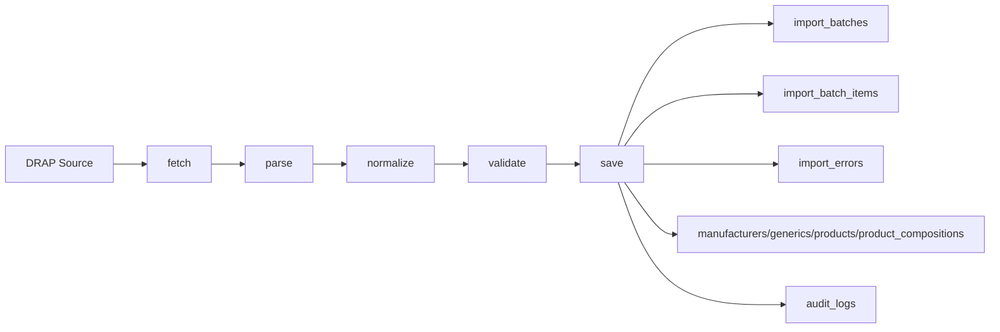
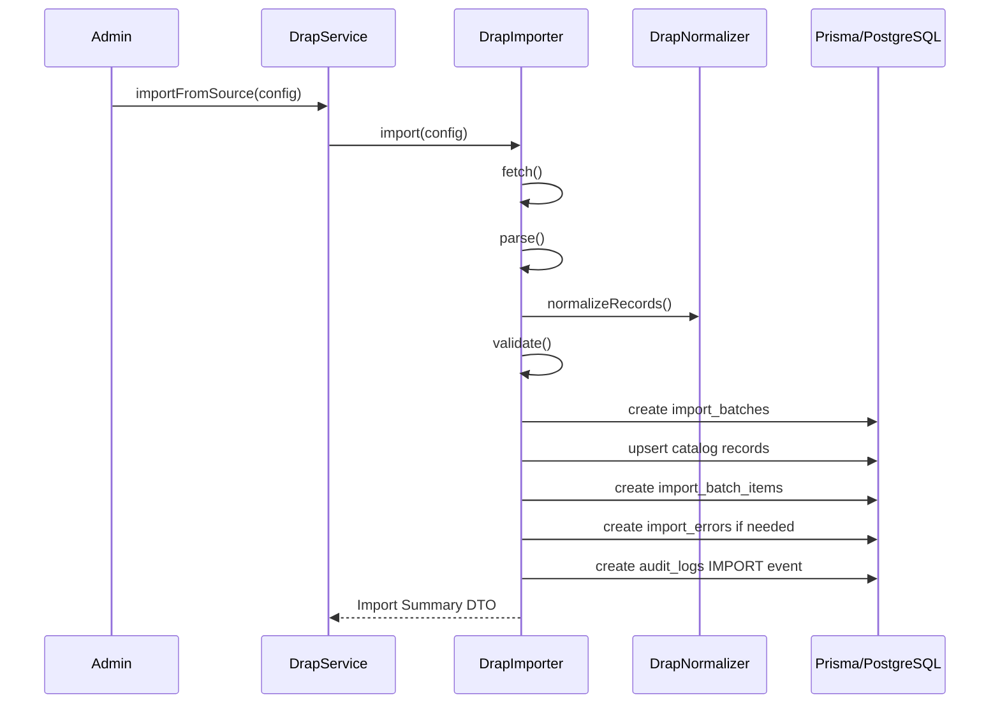

# DRAP Import Module

## Purpose

The DRAP module imports medicine registration/product data into PostgreSQL through Prisma-compatible persistence.

## Files

- `drap.module.ts`: module entrypoint and factories
- `drap.service.ts`: service facade
- `drap.importer.ts`: fetch, parse, normalize, validate, save orchestration
- `drap.normalizer.ts`: normalization and medicine signature generation
- `drap.types.ts`: source adapter, DTO, import report, and persistence interfaces
- `samples/drap.sample.csv`: sample import dataset

## Architecture Diagram

## Sequence Diagram

## Test Plan

- Parse `samples/drap.sample.csv` with the CSV adapter.
- Verify three raw records are parsed.
- Verify generated signatures include:
  - `amoxicillin_clavulanic_acid_625mg_tablet`
  - `paracetamol_500mg_tablet`
  - `ibuprofen_400mg_tablet`
- Run import against a test PostgreSQL database after Prisma client generation.
- Verify created or reused records in:
  - `manufacturers`
  - `generics`
  - `products`
  - `product_compositions`
  - `import_batches`
  - `import_batch_items`
  - `audit_logs`
- Verify invalid rows are written to `import_errors`.

## Current Verification Limit

This workspace does not currently include `package.json`, installed dependencies, generated Prisma client, or a live PostgreSQL database, so runtime import verification is pending.

