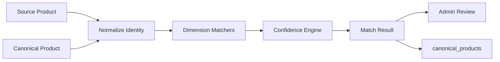
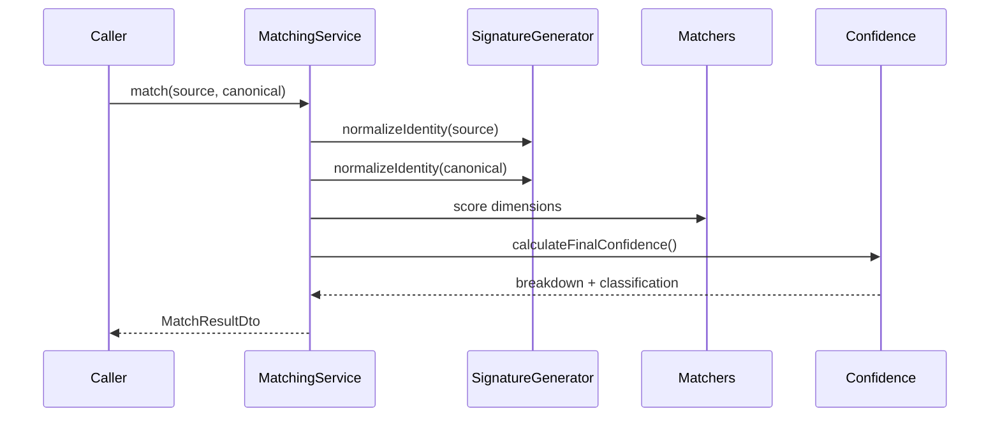

# Medicine Matching Engine

## Purpose

The Medicine Matching Engine creates the canonical medicine identity system for DawaiSaver.pk. It is the single source of truth for matching imported products, pharmacy source products, price snapshots, and future user-derived medicine records to canonical products.

## Files

- `matching.module.ts`: module factory and exports
- `matching.service.ts`: matching orchestration
- `brand-matcher.service.ts`: brand similarity
- `generic-matcher.service.ts`: generic ingredient similarity
- `strength-matcher.service.ts`: strength comparison
- `manufacturer-matcher.service.ts`: manufacturer similarity
- `signature-generator.service.ts`: canonical normalization and signature generation
- `confidence-engine.service.ts`: confidence calculation and match classification
- `matching.types.ts`: DTOs, confidence breakdowns, explanations, and review types

## Architecture Diagram

## Sequence Diagram

## Test Plan

- Verify canonical signatures:
  - `amoxicillin_clavulanic_acid_625mg_tablet`
  - `esomeprazole_40mg_capsule`
  - `atorvastatin_20mg_tablet`
- Verify exact matches classify as `matched`.
- Verify partial matches classify as `possible_match` or `needs_review`.
- Verify duplicate brands, products, manufacturers, and signatures are detected.

## Current Verification Limit

The workspace has no `package.json`, test runner, generated Prisma client, or live database.

