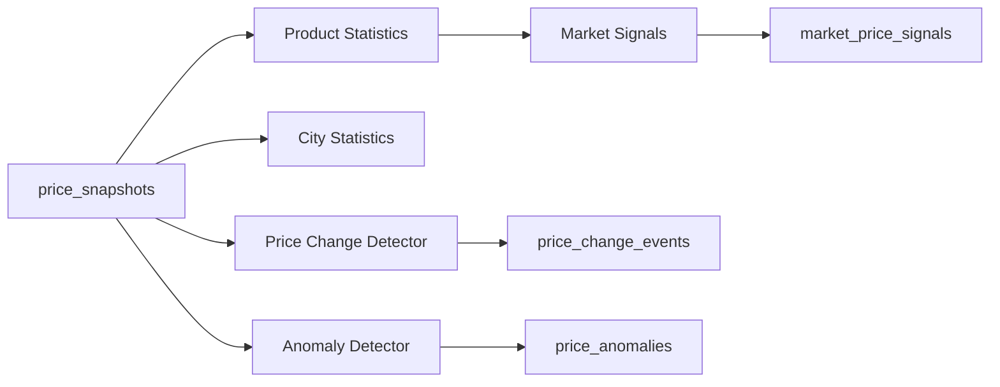
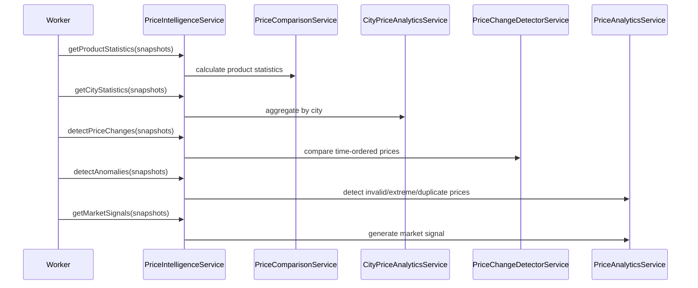

# Price Intelligence Engine

## Purpose

The Price Intelligence Engine transforms raw `price_snapshots` into product statistics, city statistics, market signals, price change events, anomalies, and trends.

## Files

- `price-intelligence.module.ts`: module factory and exports
- `price-intelligence.service.ts`: internal API facade
- `price-comparison.service.ts`: product-level statistics
- `price-analytics.service.ts`: market signals, anomalies, trends
- `price-change-detector.service.ts`: change event detection
- `city-price-analytics.service.ts`: city-level aggregation
- `price-intelligence.types.ts`: DTOs and calculation contracts
- `testing/sample-price.dataset.ts`: sample price snapshots
- `testing/analytics.test.ts`: product and market analytics scaffold
- `testing/change-detection.test.ts`: price change test scaffold
- `testing/city-aggregation.test.ts`: city aggregation test scaffold

## Architecture Diagram

## Sequence Diagram

## Test Plan

- Run product analytics over `sample-price.dataset.ts`.
- Verify lowest, highest, average, median, latest, variance, source count, and availability score.
- Run city aggregation and verify Karachi and Lahore outputs.
- Run change detection and verify increase, decrease, new low, new high, and significant change events.
- Run anomaly detection and verify invalid, duplicate, suspicious drop, and suspicious spike detection.

## Current Verification Limit

This workspace has no `package.json`, dependency installation, TypeScript compiler, generated Prisma client, live database, or test runner.

