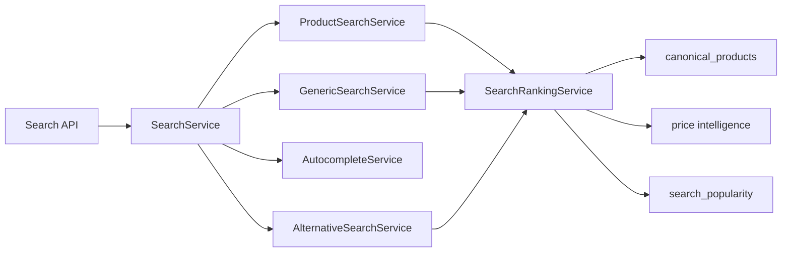
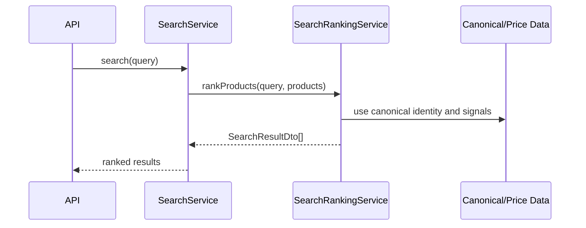

# Search API Foundation

## Purpose

The Search API Foundation creates the backend search layer over canonical medicine identity, price intelligence, availability, and popularity signals.

## Files

- `search.module.ts`: module factory and exports
- `search.service.ts`: internal service facade
- `product-search.service.ts`: product search
- `generic-search.service.ts`: generic search
- `alternative-search.service.ts`: alternative search
- `autocomplete.service.ts`: prefix, partial, synonym, typo-tolerant autocomplete
- `search-ranking.service.ts`: ranking factors
- `search.types.ts`: DTOs and search contracts

## Architecture Diagram

## Sequence Diagram

## Test Plan

- Product search returns exact brand matches first.
- Generic search returns matching canonical products.
- Autocomplete supports prefix, partial, typo, synonym, and popularity boosting.
- Alternative search returns equivalent brands and price statistics.

## Current Verification Limit

This workspace has no `package.json`, generated Prisma client, backend HTTP runtime, or test framework.

