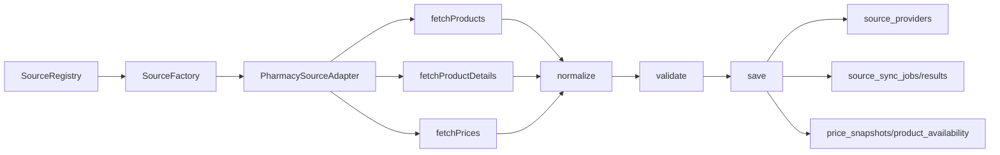
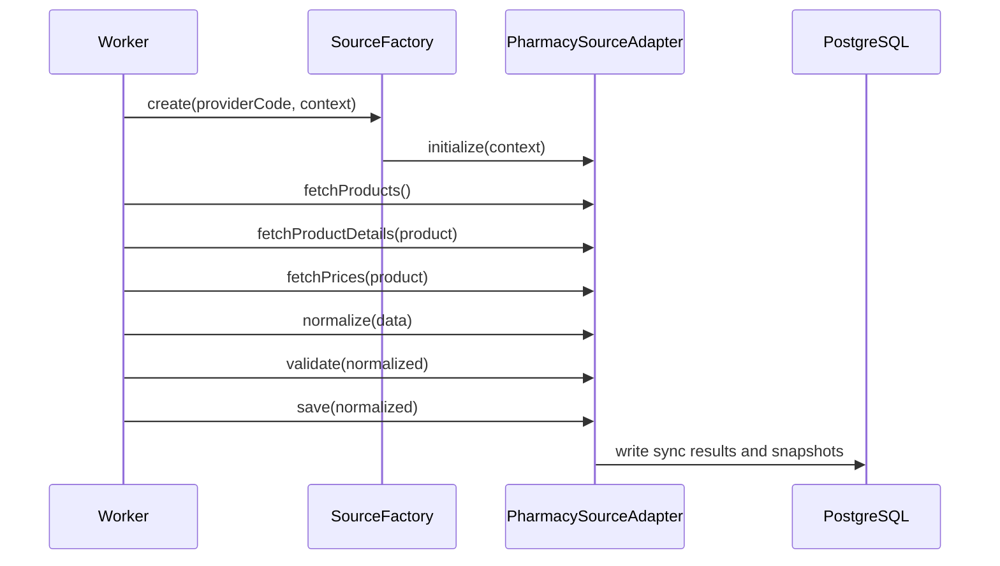

# Source Adapter Framework

## Purpose

The source adapter framework provides reusable contracts for future online pharmacy integrations such as Dawaai, Sehat, DVAGO, Servaid, pharmacy websites, and APIs.

No provider-specific scraper logic is implemented in this module.

## Files

- `source.module.ts`: module exports and factory helpers
- `source.types.ts`: DTOs and shared source data types
- `source.interfaces.ts`: adapter contracts
- `source.registry.ts`: adapter registry
- `source.factory.ts`: adapter factory and matching utilities
- `testing/mock-source.adapter.ts`: mock adapter for validation
- `testing/sample-source.dataset.ts`: sample source product and price data
- `testing/source.adapter.validation.test.ts`: adapter validation test scaffold

## Architecture Diagram

## Sequence Diagram

## Test Plan

- Register `MockSourceAdapter` in a fresh `SourceRegistry`.
- Create it through `SourceFactory`.
- Fetch products and prices from the sample dataset.
- Normalize products into medicine signatures.
- Validate the normalized output.
- Confirm `amoxicillin_clavulanic_acid_625mg_tablet` is generated.
- Run the test scaffold after a TypeScript test runner exists.

## Current Verification Limit

This workspace does not currently include a test framework, generated Prisma client, or project build configuration.

